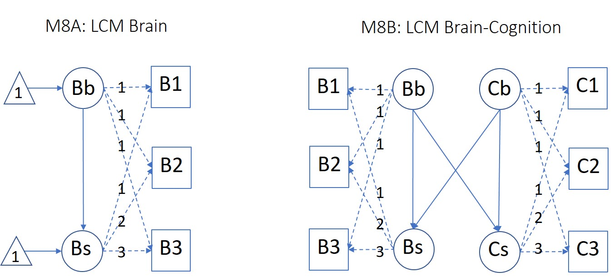

---
title: "Relating Age, Brain and Cognition (ABC)"
author: "Rik Henson (with thanks to Rogier Kievit & Ina Demetriou)"
date: "2024-07-19"
output: html_document
---

```{r setup, include=FALSE}
knitr::opts_chunk$set(echo = TRUE)
library('ggplot2')
library('GGally')
library('lavaan')
library('lme4')
library('lmerTest')
library('tidySEM')
```

# TODO: 
Add A1 to LCM and LCSM models, to check no cross-sectional effects leak into long
from {r LCM B+C} section onwards

# A primer on relating Age, Brain and Cognition: As easy as "ABC"?

This is a primer on simple linear statistical models for relating Age, Brain and Cognition (or indeed any three variables A, B and C). The outcome variable we care about is C, whereas the A variable is generally assumed to be the main cause of variation in C, and one question is how this covariation relates to B. The focus is on different ways of modelling A, B and C, particularly how to treat A (age). Some of this is inspired by the paper by [Salthouse, 2011](https://pubmed.ncbi.nlm.nih.gov/21463028/). We start with cross-sectional data, before turning to longitudinal data. 

## 1. Cross-sectional measures 

Let's start by assuming with have one value for A, B and C from each of "npt" participants (later we will consider latent factors for A, B and C derived from multiple measures of each). We'll start with defining the Age variable (A) as being drawn from a Gaussian distribution: 

```{r Initialisation}
set.seed(10)  # To render results reproducible
npt = 10000   # Number of participants, big enough to be precise
#A = runif(n = npt, min = 18, max = 88)  # Eg age-range in CamCAN!
Asd = 10      # SD of A
A = rnorm(n = npt, mean = 53, sd = Asd) # If Gaussian (around midpoint of CamCAN, which is also RH's age ;-) 
```

We first define some "true" models that generate the data for Brain (B) and Cognition (C) from the Age (A) variable. We then fit different statistical models to those data and compare the inferences one might make. We start with the General Linear Model (GLM), which can estimate a single relationship between two sets of multiple variables (e.g. from multiple regression on a single variable, to multivariate methods like CCA/PLS). Later we move to more general path models like Structural Equation Modelling (SEM) that can estimate two or more relationships between variables. 

Note that GLMs only assume that the error is Gaussian, while the default maximum likelihood (ML) estimator for SEMs only assumes that endogenous variables (those that "receive" a path from another variable) are Gaussian (though extensions of SEM exist to handle other distributions for variables).

### 1.1. General Linear Model for one relationship

#### 1.1.1. Sequential Causes

We first generate data from a model where A causes B, and B causes C, with some random additional Gaussian variation in each case. This is shown in left panel of Figure 1 (M1). 

 
&nbsp; 

We can gather the results in a data-frame "df1":

```{r Data1: A->B->C}
Bsd = 10     # SD of B
Csd = 10     # SD of C
B = A + rnorm(n = npt, mean = 0, sd = Bsd)
C = B + rnorm(n = npt, mean = 0, sd = Csd)  
df1 = data.frame(A, B, C)
```

We can perform multiple regression (GLM1) to test dependence of C on A and/or B:

```{r Data1, GLM1}
GLM1 <- lm(C ~ B + A, data = df1)
drop1(GLM1, test="F") 
```

This shows a significant effect of B but not A. This is not incorrect, but note that one cannot interpret this as Cognition being independent of Age, because a large amount of variation in Brain that causes Cognition is itself caused by Age (i.e, the Brain measure fully mediates the effect of Age on Cognition; see later).

As an aside, note that, by changing the relative sizes of variance in B and C, we can derive another situation where there is a significant effect of B on C when tested alone...

``` {r Data1b, GLMb}
Bsd = 2
Csd = 100
B = A + rnorm(n = npt, mean = 0,  sd = Bsd)
C = B + rnorm(n = npt, mean = 0,  sd = Csd)  

df = data.frame(A, B, C)
GLM <- lm(C ~ B, data = df)
drop1(GLM, test="F")
```

...but which no longer reaches significance once A is included in the model:

``` {r Data1b, GLM1c}
GLM <- lm(C ~ A + B, data = df)
drop1(GLM, test="F") # Incorrect conclusion that no effect of A

```

This "age as a covariate" is a common situation that tempts people to argue that Cognition is not related to Brain afterall, since its effect disappears when adjusting for Age. But we know here (because we generated the data) that Brain does contribute to Cognition. However, because Brain also depends on Age, Brain and Age are highly correlated, so the linear model cannot attribute unique variance to either of them. This can be visualised:

```{r Data2cor, echo=FALSE}
ggpairs(df)
```

where the extremely high correlation between A and B means that it is difficult to detect their unique contributions to C. Of course, this is just another case of "absence of evidence" not being "evidence of absence", particularly pertinent when statistical power is low, here because of the massive correlation between regressors.) So it would be wrong to conclude Brain is irrelevant to Cognition (in contrast to the next example below). 

#### 1.1.2. Common Cause

We can also create second dataset (``df2``) where A causes both B and C, but B and C are not directly related (model M2 in Figure 1):

```{r Data2: A->B, A->C}
Bsd = 10
Csd = 10
B <- A + rnorm(n = npt, mean = 0, sd = Bsd)
C <- A + rnorm(n = npt, mean = 0, sd = Csd)
df2 <- data.frame(A, B, C)
```

In this case, while a simple regression might suggest a relationship between B and C...

```{r Data2, GLMs}
GLM2   <- lm(C ~ B, data = df2)
drop1(GLM2, test="F") 
```

...this is not the case when A is added as a covariate, which is correct:

```{r Data2, GLMs2}  
GLM2   <- lm(C ~ B + A, data = df2)
drop1(GLM2, test="F") 
```

Thus to summarise, adjusting for A can lead to a correct conclusion (that no direct association between B and C), as in the last example above, but can also lead to the same conclusion even when we know that there is in fact a direct association between B and C, as in the previous example where A and B are highly correlated. This reflects a limitation with the GLM approach; so how can we know whether to adjust for a correlated variable like Age or not? SEM provides one solution...

### 1.2. Structural Equation Modelling for multiple relationships

#### 1.2.1. Sequential Causes 

The main advantage of path models like SEM is that they can handle more than one relationship (path), i.e., involve more than one "~" in linear modelling notation. We can then fit two models and test which is more likely to have generated the data (in terms of the full covariance matrix of A, B and C). Let's start with data generated from the Sequential Model M1, where A->B->C, and then fit by the corresponding SEM (using the "lavaan" package in R): 

```{r Data1, SEM1}
SEM1 <- 'C ~ B
         B ~ A'
SEM1_df1 <- sem(SEM1, data=df1) # SEM1 fit to Dataset1
#summary(SEM1_df1, fit.measures = TRUE, estimates = TRUE, standardize = TRUE, rsquare = TRUE)
anova(SEM1_df1) 
```

The Chi-square test shows that the model cannot be rejected (i.e, fits reasonably well). Compare this to the fit of the second (incorrect) model (M2) in which B and C are correlated only through shared dependence on A, as below: 

```{r Data1, SEM2}
SEM2 <- 'B ~ A
         C ~ A' 
SEM2_df1 <- sem(SEM2, data=df1) 
#summary(SEM2_df1, fit.measures = TRUE, estimates = TRUE, standardize = TRUE, rsquare = TRUE)
anova(SEM2_df1) 
```

This model is more complex than the first one, because it also includes a parameter to model the residual covariance between B and C (to see this, uncomment the ``summary`` commands above). Indeed, the model is saturated (no df's left), so you cannot use the Chi-square test for model fit. However, you can use the BIC metric, which, as expected, is smaller (better) for the correct (first) model SEM1 (because it is simpler). (Note that this BIC result does depend on the data - for some random seeds, the BIC can be lower for the second, incorrect model, but if you simulate a number of datasets, you will see that BIC more often favours the correct model.) Alternatively, you could set the B-C covariance parameter of SEM2 to zero by adding to the SEM definition ``C ~~ 0*B``, thereby equating the number of parameters in each model, and then model comparison will favour SEM1.

#### 1.2.2. Common Cause

We can also do the converse, ie compare SEM1 and SEM2 in their ability to fit data generated by model M2 with common cause (where SEM2 is now the correct model). 

```{r Data2, SEM1+2}
SEM1_df2 <- sem(SEM1, data=df2) 
SEM2_df2 <- sem(SEM2, data=df2) 
#anova(SEM1_df2)
anova(SEM2_df2, SEM1_df2) 
```

This time, the Chi-square, AIC and BIC all favour SEM2 instead, as expected (indeed, if you uncomment the preceding "anova" call, you will see that SEM1 is correctly rejected by the data).

#### 1.2.3. Reversing "causality"

A third SEM we can test is one in which the direction of the sequential model is altered, ie A causes C, and C causes B (M3 in Figure 1). When we fit SEM3 to data generated by M1:

```{r Data1, SEM3}
SEM3 <- 'C ~ A
         A ~ B'
SEM3_df1 <- sem(SEM3, data=df1) 
anova(SEM3_df1)
```

we can see that SEM3 is correctly rejected by the data (unlike the fit of SEM1, which is not rejected by data, as shown in Section 2.1 above). This is because SEM1 predicts greater covariance between B and C than between A and C (as found in data, given their sequential generation), whereas SEM3 predicts opposite of greater covariance between A and C than between B and C. In other words, SEM can provide some insight on the possible causal direction of relationships between variables (the "watershed" approach, e.g., [Kievit et al. 2016](https://doi.org/10.1016/j.neuropsychologia.2016.08.008)). 

However, you will note that the AIC and BIC are actually lower for SEM3 (above) than SEM1 (Section 1.2.1). This relates to the scaling of the data, which affects AIC/BIC (but not Chi-square): The B variable has greater spread than the A variable (since B is generated by adding independent variance to A), so the residuals of the model fit will be numerically greater when B is an endogeneous variable (in SEM1) than when it is an exogeneous variable (at base of SEM3), leading to worse AIC/BIC, even though the proportion of total variance explained is less. This can be addressed by re-scaling (Z-scoring) all the variables first, as illustrated below: 

```{r Data1z, SEM3z}
df1$Az<-scale(df1$A)
df1$Bz<-scale(df1$B)
df1$Cz<-scale(df1$C)
SEM1z <- 'Cz ~ Bz
          Bz ~ Az'
SEM1z_df1 <- sem(SEM1z, data=df1) 
SEM3z <- 'Cz ~ Az
          Az ~ Bz'
SEM3z_df1 <- sem(SEM3z, data=df1) 
anova(SEM1z_df1)
anova(SEM3z_df1)
```

Note also that we could reverse M1 fully, i.e. have B cause A and C cause B. If you try this (with commented code below), you will see that this fully reversed SEM3 fits the data as well as SEM1 according to Chi-square. This is because both predict less covariance between A and C than between B and C, and than between A and B. In fact, the fully-reversed SEM3 actually fits better according to AIC/BIC. The latter again relates to the scaling of the data: The greater spread of the C variable (since generated by adding A and B) leads to higher absolute residuals (and hence worse AIC/BIC) when it is the outcome variable than when A is the outcome variable. After Z-scoring however, the two models can no longer be distinguished (have equivalent AIC/BIC), as also illustrated below. This is because their predicted covariance matrices (after scaling) are identical, demonstrating the limitations of SEM for inferring directionality.

```{r Data1z, SEM3_fullz}
SEM3 <- 'A ~ B
         B ~ C'
SEM3_df1 <- sem(SEM3, data=df1)
anova(SEM1_df1)
anova(SEM3_df1)

SEM3z <- 'Cz ~ Bz
          Bz ~ Az'
SEM3z_df1 <- sem(SEM3z, data=df1) 
anova(SEM1z_df1)
anova(SEM3z_df1)
```

More generally, note that there are some restrictions on using SEM for such model comparison. For example, you can only compare SEMs that include the same variables, i.e, that fit the same data covariance matrix. Thus you cannot use Chi-square, AIC or BIC to compare the SEM ``C~A`` with the SEM ``C~A+B`` (this is unlike the GLM, where you can use such metrics, because the model fit is always restricted to the outcome variable C). Thus if you wanted to ask whether a SEM in which C depends only on A is better than one where it depends on A and B, then you would compare ``C~A+B`` with ``C~A+0*B``. Note furthermore that while Chi-square could be used in this situation, it can only be used to compare nested models, e.g., cannot be used to compare ``C~A+B`` with ``C~A, A~B``, because one parameter (C~B path) has been removed in second case while another (A~B path) has been added. In the latter situation, you need to use AIC/BIC (or some other metric).

#### 1.2.4. Rejecting over-complete models

A fourth SEM we can test is one in which the sequential model is augmented with an additional, direct connection from A to C (rendering it fully saturated), as in M4 shown in leftmost panel of Figure 2:

 
&nbsp; 

This is implemented by SEM4:

```{r Data1, SEM4}
SEM4 <- 'C ~ B
         B ~ A
         C ~ A' 
SEM4_df1 <- sem(SEM4, data=df1) 
#anova(SEM4_df1)
anova(SEM1_df1, SEM4_df1) 
```

The Chi-square difference is too small to be significant (given the difference in 1 df), but the BIC is lower for SEM1 than SEM4, suggesting that the extra parameter is not needed, i.e, the more parsimonious SEM1 model is more likely to be the true model.

#### 1.2.5. Simple (cross-sectional) mediation

While SEM4 above was worse when fitting the data generated by SEM1, we can generate data from SEM4 to illustrate the concept of Brain as a mediator of the dependence of Cognition on Age:

```{r Data4, SEM4}
B <- A + rnorm(n = npt, mean = 0, sd = Bsd)
C <- B + A + rnorm(n = npt, mean = 0, sd = Csd) # Now direct contribution from A too
df4 <- data.frame(A, B, C)
SEM4 <- '
    C ~ c1 * A
    B ~ a1 * A; C ~ b1 * B
    Total := (abs(a1*b1)) + (abs(c1))
    Mediation := a1*b1
    Proportion_mediated := abs(Mediation) / Total'
SEM4_df4 <- sem(SEM4, data=df4) 
summary(SEM4_df4, header=FALSE, cov.std = FALSE)
# SEM5 <- '
#     B ~ c1 * A
#     C ~ a1 * A; B ~ b1 * C
#     Total := (abs(a1*b1)) + (abs(c1))
#     Mediation := a1*b1
#     Proportion_mediated := abs(Mediation) / Total'
# SEM5_df4 <- sem(SEM5, data=df4) 
# anova(SEM4_df4, SEM5_df4)
```

Here we just have named the paths in SEM4 (``a1, b1...`` etc) in order to calculate the proportion of variance explained by the mediator (B), which is close to 50% (and highly significant). Thus we can say that Brain (partially) mediates the effect of Age on Cognition. However, there are dangers in inferring causality from mediation models, particularly concerning age effects from cross-sectional data ([Raz and Lindenberger, 2011](https://www.ncbi.nlm.nih.gov/pmc/articles/PMC3160731/)). We demonstrate this later with the longitudinal modelling. 

Note also that one can swap B and C (as commented out in SEM5) and equally conclude that cognition mediates the effect of age on the brain (which is plausible, eg cognition may affect lifestyle choices that affect brain health). Thus inferences from mediation analyses are also best when there are theoretical reasons for a particular causal chain that you wish to test statistically.

Note that mediation is sometimes tested with a series of GLMs, i.e., showing that ``C~A`` is significant, ``B~A`` is significant, and that B still has a significant effect in the (partial regression) model ``C~B+A``, but it is more elegant to test within a single SEM.

##### 1.2.6.1 Moderation within SEM

Age can also be a moderator, such that the effect of Brain on Cognition depends on Age (e.g, perhaps a stronger relationship in older people). This is sometimes depicted as one variable impacting on the path between two others, as in second panel of Figure 2. One way to test this within a single SEM is to add the A*B interaction term as a new variable that causes variance in C (as in third panel of Figure 2). First we will create some data in which an interaction is present. Note it is important to mean-correct A and B before multiplying them so that the interaction is less correlated with the main effects. It is often also advisable to scale them so that they have similar SD (i.e, Z-score), to ensure comparable ranges (see [my Rmd on interactions](https://github.com/MRC-CBU/miscellaneous/tree/master/power-for-interactions)).

```{r Data5}
A   <- scale(df1$A)
#A  <- scale(as.numeric(df1$A>53)) # If want binary groups for age
B   <- scale(df1$B)
AB  <- scale(A*B)
C   <- B + AB + rnorm(n = npt, mean = 0, sd = Csd) # Now interaction term A*B
df5 <- data.frame(C, A, B, AB)
ggpairs(df5)
```

Note the interaction term ``AB`` is not Gaussian, since it is the (nonlinear) product of two distributions - but again this does not matter for SEM provided it is an exogeneous variable only. We can then test the SEM:

```{r Data5, SEM5}
SEM5 <- 'C ~ B + AB'
SEM5_df5 <- sem(SEM5, data=df5) 
summary(SEM5_df5,  header=FALSE, cov.std = FALSE)
```

which confirms that the ``AB`` path on ``C`` is significant, as expected. Note that, while we have talked about this indicating that Age moderates effect of Brain on Cognition, the interaction is symmetrical, so one could also say that Brain moderates the effect of Age on Cognition. 

We can compare this interaction approach to an alternative way of modelling moderations, in which we fit separate SEMs for two or more levels of the moderator, using "multi-group" SEMs, as M6 shows graphically in Figure 2. 

##### 1.2.6.2 Moderation across SEMs

Let's define two groups of participants - the young and the old - depending on whether their age is above 53 (so RH still counts as "young" ;-). This is coded by the new factor ``Ag`` below, which is passed to SEM via the additional "group" argument. This effectively fits separate SEMs for each group: 

```{r Data5, SEM6.free}
df5$Ag <- factor(df1$A>53)
levels(df5$Ag) = c("Young","Old")
SEM6.free <- 'C ~ B'
SEM6.free_df5 <- sem(SEM6.free, data=df5, group="Ag") 
summary(SEM6.free_df5,  header=FALSE, cov.std = FALSE)
```

It can be seen that the path from B to C is significant in the Old group, but not the Young group, consistent with how the data were generated in terms of the effect of B on C being greater with higher values of A (together with an overall main effect of B). To formally test this interaction, we can compare the above SEM, in which the B-C path is freely estimated within each age group, to another SEM in which the parameter for that path is equated across age groups:

```{r Data5, SEM6.eqtd}
SEM6.eqtd <- 'C ~ c(b1,b1) * B'
SEM6.eqtd_df5 <- sem(SEM6.eqtd, data=df5, group="Ag") 
#summary(SEM6.free_df5,  header=FALSE, cov.std = FALSE)
anova(SEM6.free_df5, SEM6.eqtd_df5)
```

As expected, the model in which the B-C relationship was equated across age groups (``SEM6.eqtd``) is significantly worse, supporting the presence of a moderation of this relationship by A.

Note that the data were generated with a continuous linear interaction, whereas here we are modelling it in terms of binary age split, so the latter will not be as sensitive as the within-SEM model above, consistent with the equivalent Z-value for the interaction path when comparing ``SEM6.free`` with ``SEM6.eqtd`` (``sqrt(49.735)=7.052``), being less than the Z-value for the AB-C path in ``SEM5`` (``9.309``). Of course this would not be case if we generated the data with a binary moderation instead, in which case the two models would have equivalent sensitivity (which can be checked by uncommenting the line that generates the ``A`` variable for ``df5`` above, to make it binary; after re-running all subsequent code, you should find equivalent Z-scores for the moderation in both ``SEM5`` and comparison of ``SEM6.free`` with ``SEM6.eqtd``). Alternatively, one could use a moving window of ages to trace out the B-C relationship as a smooth function of the (median) age within each window (see [Robitzsch, 2023](https://www.researchgate.net/publication/373623425_Estimating_Local_Structural_Equation_Models) and [di Mooij et al.](https://doi.org/10.1523/JNEUROSCI.1627-17.2018) for an example).

#### 1.2.7 Latent Variables

So far, we have treated A, B and C as single measured variables. Often we might have multiple measures of Brain, Cognition, etc, and wish to summarise them in terms of a latent factor (cf. factor analysis). This brings the real power of SEM in combining definition of latent variables (indicated in lavaan by ``~=``) and regressions between variables (with ``~``, as in examples above). 

Let's assume we have three measurements of B and C, called B1, B2, B3, and C1, C2, C3 respectively, as shown in left panel of Figure 3.


&nbsp; 

We can generate some data via the moderation model above and also generate the measured variables:

```{r Data5, latent}
A   <- scale(as.numeric(df1$A>53)) # Now binary groups for age
B   <- scale(df1$B)
AB  <- scale(A*B)
C   <- B + AB + rnorm(n = npt, mean = 0, sd = Csd) 

Msd <- 1 # measurement noise

C1 <- C + rnorm(n = npt, mean = 0, sd = Msd) 
C2 <- C + rnorm(n = npt, mean = 0, sd = Msd)
C3 <- C + rnorm(n = npt, mean = 0, sd = Msd)

B1 <- B + rnorm(n = npt, mean = 0, sd = Msd) 
B2 <- B + rnorm(n = npt, mean = 0, sd = Msd)
B3 <- B + rnorm(n = npt, mean = 0, sd = Msd)

Ag  <- factor(A); levels(Ag) = c("Young","Old")

df6 <- data.frame(Ag, C1, C2, C3, B1, B2, B3)
#ggpairs(df6)
```

We can now define a new SEM consisting of two parts: the "measurement model", in which new latent factors ``Cf`` and ``Bf`` are defined from their respective measurements, and the "structural model", in which these factors are related via regression (as in examples above):

```{r Data5, SEM7.free}
SEM7.free <-  '
# measurement model
    Cf =~ C1 + C2 + C3
    Bf =~ B1 + B2 + B3
# structural model
    Cf  ~ Bf'
SEM7.free_df6 <- sem(SEM7.free, data=df6, group="Ag") 
#summary(SEM7.free_df6,  header=FALSE, cov.std = FALSE)
```

Using multi-group SEM, we could ask whether the relationship between Brain and Cognition varies with Age (as in examples above), but we could also ask whether the factors themselves vary with age, by comparing the above model with one in which the loadings of each factor on their measurements are equated across groups:

```{r Data5, SEM7.eqtd}
SEM7.eqtd <-  '
# measurement model
    Cf =~ c(c1,c1) * C1 + c(c2,c2) * C2 + c(c3,c3) * C3
    Bf =~ c(b1,b1) * B1 + c(b2,b2) * B2 + c(b3,b3) * B3
# structural model
    Cf  ~ Bf'
SEM7.eqtd_df6 <- sem(SEM7.eqtd, data=df6, group="Ag") 
#summary(SEM7.eqtd_df6,  header=FALSE, cov.std = FALSE)
anova(SEM7.eqtd_df6,SEM7.free_df6)
```
 
The decrease in Chi-square for the more complex model (SEM7.free) is not significant, given its extra 4 dfs (parameters), and the AIC and BIC are lower for the equated model in which the factor loadings are fixed across age groups. This "measurement invariance" is normally good news, because it suggests that we can use the same latent factors across age groups.

Finally, note that we could equally define Age as a latent factor (right panel of Fig 3), itself estimated from multiple measures, such as various brain measures (B1, B2), epigenetic measures (E1, E2) such as telomere length (E1), and even number of wrinkles, etc. Such estimates of "biological age" might be more accurate than simply the number of revolutions around the sun.

## 2. Longitudinal measures

Ok, so what if we measure each person longitudinally, as they grow older? In general, *changes* within a person across time are more likely to reflect ageing than *differences* across people of different ages, since the latter can also reflect generational effects (or "cohort effects"), like changes in diet or education over the years (though longitudinal data are prone to other confounds instead, like practice effects if cognitive tests are repeated; see later). Longitudinal analysis can provide better evidence for causality, using the idea of temporal precedence, i.e, B is more likely to cause C if the state of B relates better to the future state of C than vice versa.

There are several ways to model longitudinal change (see for example [McCormick et al. 2016](https://doi.org/10.31234/osf.io/ga4qz) for review). Here we start with linear mixed effects (LME) models (hierarchical GLMs) before returning to SEM.

### 2.1. Designs and generating data 

A common cross-sectional design assesses a group of people at a single time point (date of assessment, DoA, e.g, during the year 2020), where variation in their age at assessment arises from their different dates of birth (DoB), as in Fig 4A. In this case, age is confounded with any historical (eg generational, environmental, cultural...) changes that occurred across the range of DoBs. Another alternative is to recruit people with the same DoB (a "birth cohort"), and test them at different times, as in Fig 4B, though this is still confounded by historical changes across DoAs. Best are longitudinal designs like in Fig 4C, where multiple DoAs ("waves" of testing) allow some ability to adjust for the effects of DoB on age at test (e.g, the age of the first participant at the second DoA in Fig 4C, ie the length of the top line from circle to second arrowhead, can be matched with that of the second participant at their first DoA, ie length of second line from circle to first arrowhead). Moreover, the repeated measures inherent in longitudinal designs allow one to model out other variations between people that are independent of their age (e.g, genetics - at least those genetics that do not affect rate of ageing!), such that changes over time between DoAs better estimate the (common) processes of ageing. Other terms commonly used for stable individual differences (traits) are "intercept", "level", "offset", or "baseline" as distinct from "change" or "slope". 

 
&nbsp;

For the above reasons, we will illustrate how to model universal time (DoB and DoA) rather than Age per se. First though, we need to create some data with a more complex mixture of within-participant (longitudinal) changes and between-participant (cross-sectional) differences, by assuming multiple measurements each of B and C: once at "baseline" (DoA1) and then at one more follow-ups (e.g., DoA2, DoA3...) after a range of temporal "lags" (e.g., DoA2-DoA1). We'll do this with a general function that takes the arguments defined below (along with a second function to plot data). Although this function looks complicated, we will unpack it in subsequent examples:

```{r CS+LG functions}
long_data <- function(rng_DoB, rng_bas, rng_lag, CS, LG, num_waves=2, noise_sd=1, npt=10000) {
  
  # Generate num_waves of data assuming sequential model of A->B->C
  #
  # rng_DoB = min and max of Date of Birth
  # rng_bas = min and max of Date of First (Baseline) wave
  # rng_lag = min and max of lags between waves 
  #           (random across participants, but same range across waves)
  #
  # CS[1]   = A->B cross-sectional effect
  # CS[2]   = B->C cross-sectional effect
  # LG[1,1] = A->B longitudinal effect;     LG[1,2] = A->B age-dependent effect 
  # LG[2,1] = B->C longitudinal effect;     LG[2,2] = B->C age-dependent effect
  #
  # noise_sd = measurement noise 
  #
  # No self-dependence yet, eg where change in B depends on level of B (Matthew Effect)
  
  DoA <- matrix(data=NA,nrow=npt,ncol=num_waves) # date (year) of assessment
  wav <- matrix(data=NA,nrow=npt,ncol=num_waves) # wave number
  A <- matrix(data=NA,nrow=npt,ncol=num_waves)
  B <- matrix(data=NA,nrow=npt,ncol=num_waves)
  C <- matrix(data=NA,nrow=npt,ncol=num_waves)

  DoB = round(runif(n = npt, min = rng_DoB[1], max = rng_DoB[2])) # date (year) of birth

  wav[,1] = 1
  DoA[,1] = runif(n = npt, min = rng_bas[1], max = rng_bas[2]) # date of baseline wave
  # !!!min(DoA) should be greater than max(DoB)!!!
  
  BaB = rnorm(n = npt, mean = 100, sd = 8)  # distribution of Brain at baseline
  CaB = rnorm(n = npt, mean = 100, sd = 8)  # distribution of Cognition at baseline
  
  A[,1] = DoA[,1] - DoB                     # Age at baseline
  B[,1] = BaB + CS[1]*(A[,1] - mean(A[,1])) # Cross-sectional effect of Age on Brain
  C[,1] = CaB + CS[2]*(B[,1] - mean(B[,1])) # Cross-sectional effect of Brain on Cognition

  for (w in 2:num_waves) {
    wav[,w] = w
    DoA[,w] = DoA[,w-1] + runif(n = npt, min = rng_lag[1], max = rng_lag[2]) 
    A[,w]   = DoA[,w] - DoB
    B[,w]   = B[,w-1] + LG[1,1]*(A[,w] - A[,w-1]) + LG[1,2]*(A[,w-1]-min(A[,1]))*(A[,w] - A[,w-1])
    C[,w]   = C[,w-1] + LG[2,1]*(B[,w] - B[,w-1]) + LG[2,2]*(B[,w-1]-min(B[,1]))*(B[,w] - B[,w-1])
  }
 
  # Add (common) measurement noise
  B = B + matrix(rnorm(n=npt*num_waves, mean = 0, sd = noise_sd), ncol = num_waves) 
  C = C + matrix(rnorm(n=npt*num_waves, mean = 0, sd = noise_sd), ncol = num_waves) 
  
  id  = rep(seq(1, npt),num_waves)
  DoB = rep(DoB,num_waves)
  df  = data.frame(id, wav=c(wav), DoB, DoA=c(DoA), A=c(A), B=c(B), C=c(C))
  return(df)
}
  
plot_long <- function(df, xlab = "A", ylab = "B", titletxt = "Scatter Plot", npt=100) {
  dfp <- subset(df, df$id<npt)
  ggplot(dfp, aes(x = get(xlab), y = get(ylab))) +
    geom_point(size = 2, stroke = 1) +
    geom_line(aes(group = id), lty = 2, colour = "black") +
    labs(x = xlab, y = ylab, title = titletxt)
}
```

Let's start with just two waves (baseline and one follow-up) after a fixed lag, in which there are only cross-sectional differences, eg due to different DoBs (no longitudinal change): 

```{r gen CS}
CS = matrix(0, nrow = 1, ncol = 2); CS[1] = -1 # Cross-sectional effect of age on brain
LG = matrix(0, nrow = 2, ncol = 2)             # No longitudinal effects

rng_DoB = c(1920,1980) # People born between 1920-1980...
rng_bas = c(2000,2000) # ...and tested in 2000...
rng_lag = c(10,10)     # ...and 2010 (ie fixed lag with min=max=10)
npt = 10000            # large just for stable estimates below
dfl = long_data(rng_DoB, rng_bas, rng_lag, CS, LG, num_waves=2, noise_sd=2, npt)
plot_long(dfl, xlab="A", ylab="B", titletxt = "Negative cross-sectional effect, fixed lag")
```

### 2.2. Mixed effects models

In the standard multiple linear regressions at the start of this primer, each variable had one value per participant. Thus we could not separate effects of age from other individual differences between participants (or from measurement noise) - ie there was only a single error term in the model. With multiple measurements per participant, we can distinguish (random) differences between participants from (fixed) effects of age (and distinguish individual differences from a single estimate of measurement noise), by treating each participant as a "random effect". This requires a hierarchical or "mixed effects" GLM (using "lmer" in R), where we model one or more fixed effects (eg age) as well as one or more random effects (eg for mean value for each participant). For notebooks that introduce mixed effects models, see [my github](https://github.com/RikHenson/CognesticStats/tree/master). 

Note that we are still limited to bivariate relationships, so will focus on just the Age->Brain relationship for moment.

#### 2.2.1. Cross-sectional effects of Age on Brain

What happens if we try to predict Brain based on Age only, using the LME equation below, which uses "Wilkinson" notation where the term "(1|id)" models a random intercept for each participant (the grand mean is always modelled unless explicitly removed):

```{r CS lme age}
summary(lmer('B ~ A + (1|id)', data = dfl))$coefficients
```
There is a highly significant negative effect of A as expected. However this effect of age is driven solely by DoB. If we add DoB:

```{r CS lme age DoB}
summary(lmer('B ~ DoB + A + (1|id)', data = dfl))$coefficients
```
the effect of A is no longer significant, as expected since the data were not generated with any longitudinal ageing. Note that the magnitude of the true cross-sectional effect of age is also recovered, though it is positive because a higher DoB means a lower age (and the effect of age used to generate data was negative). Because the DoB and A regressors are correlated, we are only seeing the unique effects of each, i.e, there is no need for any contribution from A when DoB is included.

Note that you get identical model fits with other parameterisations of this model:
```{r CS lme age DoA other}
# 1. model DoA rather than Age
s <- summary(lmer('B ~ DoB + DoA + (1|id)', data = dfl)); s$call; s$coefficients

#2. reparameterise as age at baseline (bA) and difference in age across assessments (dA):
dfl$bA <- c(dfl$A[dfl$wav==1], dfl$A[dfl$wav==1])
dfl$dA <- dfl$A - dfl$bA
s <- summary(lmer('B ~ bA + dA + (1|id)', data = dfl)); s$call; s$coefficients

# 3. create difference score and fit simpler linear model:
dfld <- data.frame(dA = dfl$A[dfl$wav==2]-dfl$A[dfl$wav==1], 
                   dB = dfl$B[dfl$wav==2]-dfl$B[dfl$wav==1])
s <- summary(lm('dB ~ 0 + dA', data = dfld)); s$call; s$coefficients
```
(and identical, non-significant coefficients for DoA and dA).

#### 2.2.2. Longitudinal (linear) effects of Age on Brain

Next we add longitudinal (true ageing) effects, plus a variable lag:

```{r gen CS+LG}
CS = matrix(0, nrow = 1, ncol = 2); CS[1] = 1    # Now positive effect of cross-sectional Age
LG = matrix(0, nrow = 2, ncol = 2); LG[1,1] = -1 # Longitudinal slope of age on brain 
rng_lag = c(1,10) 
dfl = long_data(rng_DoB, rng_bas, rng_lag, CS, LG, num_waves=2, noise_sd=2, npt=10000)
plot_long(dfl, xlab="A", ylab="B", titletxt = "Opposite cross-sectional and longitudinal effects, variable lag")
```

Note that the cross-sectional effect has been given a positive coefficient, which might reflect a factor like pollution that has increased over the years and impairs brain and cognition during development (so that older people do better because their formative years involved less pollution). This was done to illustrate Simpson's paradox, i.e, when between-participant effects have the opposite sign to within-participant effects. In any case, the LME can recover the coefficients well when modelling both DoB and DoA:

```{r lme CS+LG DoA}
summary(lmer('B ~ DoB + DoA + (1|id)', data = dfl))$coefficients

# Compare correlations between regressors
# summary(lmer('B ~ DoB + A + (1|id)', data = dfl))$coefficients
# cor.test(dfl$DoB, dfl$DoA)
# cor.test(dfl$DoB, dfl$A)
# rA <- residuals(lm('A ~ DoB', data = dfl))
# summary(lmer('B ~ DoB + rA + (1|id)', data = dfl))$coefficients

# If want to regress difference scores, get very similar answer:
# dfld <- data.frame(dA = dfl$A[dfl$wav==2]-dfl$A[dfl$wav==1], 
#                    dB = dfl$B[dfl$wav==2]-dfl$B[dfl$wav==1])
# summary(lm('dB ~ 0 + dA', data = dfld))$coefficients

# If ignore offsets, can recover Pearson correlation too:
# summary(lm('dB ~ 1 + dA', data = dfld))$coefficients
# cor.test(dfld$dA, dfld$dB)
```
(note again that DoB coefficient is negative because effect of age is positive). If you model A instead of DoA, you do not recover the correct coefficient, because, while DoB and DoA are uncorrelated, DoB and A are correlated (you can recover the correct coefficient by residualising A with respect to DoB, as illustrated by commented code above).

#### 2.2.3. Longitudinal quadratic effects of Age on Brain

In a final example, we can generate data that shows a pattern often found in ageing research, where age-related decline is accelerated, i.e, older people show faster decline (i.e, where the slope depends on the intercept). This nonlinear ageing effect is implemented by the second column in the "LG" variable (we also increase to 3 waves to better illustrate effect):

```{r gen CS+LG-A}
CS = matrix(0, nrow = 1, ncol = 2); CS[1] = -0.5     # Some cross-sectional decrease
LG = matrix(0, nrow = 2, ncol = 2); LG[1,2] = -0.05  # age-related longitudinal decrease
rng_lag = c(10,10) # fixed lag
dfl = long_data(rng_DoB, rng_bas, rng_lag, CS, LG, num_waves=3, noise_sd=2, npt=10000)
plot_long(dfl, xlab="A", ylab="B", titletxt = "Negative cross-sectional and age-dependent longitudinal change, fixed lag")
```

Now there are several ways to model these data with an LME, with increasing validity, as demonstrated by formal model comparison below. Note first that it is easier to use the parameterisation of baseline age (bA) and change in age (dA), because we can Z-score these to keep interaction terms in a reasonable range (we cannot Z-score DoB and DoA because they need to have the same reference point, ie year 0). Z-scoring (scaling) doesn't affect the statistics for the intercept (it just means that the coefficient is scaled relative to those that generated the data), but does help decorrelate the interaction term from the main effects, i.e, assign shared variance to the main effects (again, see eg [my Rmd on interactions](https://github.com/MRC-CBU/miscellaneous/tree/master/power-for-interactions)):

```{r lme CS+LG-A}
# scale to prevent 2nd-order terms below exploding
dfl$bA <- rep(dfl$A[dfl$wav==1], 3)
dfl$dA <- dfl$A - dfl$bA
dfl$bA <- scale(dfl$bA)
dfl$dA <- scale(dfl$dA)

# 1. Linear model from above
m1 <- lmer('B ~ bA + dA + (1|id)', data = dfl)
s <- summary(m1); s$call; s$coefficients

# 2. Add random slope (since participants differ in age)
m2 <- lmer('B ~ bA + dA + (dA|id)', data = dfl)
s <- summary(m2); s$call; s$coefficients
anova(m1,m2) # Random slopes help (m2 preferred over m1)

# 3. Add interaction term instead
m3 <- lmer('B ~ bA * dA + (1|id)', data = dfl)
s <- summary(m3); s$call; s$coefficients
anova(m2,m3) # Interaction term equivalent (but m3 preferred in terms of reduced model complexity)

# 4. Add quadratic effect of dA
m4 <- lmer('B ~ bA * poly(dA,2) + (1|id)', data = dfl)
#m4 <- lmer('B ~ A * poly(dA,2) + (1|id)', data = dfl) # equivalent
s <- summary(m4); s$call; s$coefficients
anova(m3,m4) # Quadratic effects help (m4 preferred over m3)

# 5. Add random slopes
m5 <- lmer('B ~ bA * poly(dA,2) + (dA|id)', data = dfl)
s <- summary(m5); s$call; s$coefficients
anova(m4,m5) # No individual variation in slopes beyond that due to dA (m5 preferred)
```

Thus the best model is one that models a quadratic effect of (longitudinal) ageing, where the amount of change depends on (interacts with) people's baseline age. Note this equivalent to change depending on current age.

#### 2.2.4. Distinguishing ageing from practice effects

One problem with longitudinal cognitive testing is practice effects: people tend to get better at a test the more times they do it. Such practice effects are difficult to disentangle fully, but two ways to distinguish the effects of ageing from effects of practice are: 1) assume that practice effects do not change (eg attenuate) over time (lag), then jitter the lags (which works even if only 2 waves), or 2) assume practice effects asymptote after the first attempt, in which case having 3 waves, even if with fixed lag, is sufficient to separate them from linear age effects (capturing nonlinear age effects requires even more waves). Both these strategies decorrelate the regressor for practice effects from those for longitudinal ageing, as illustrated by uncommenting the relevant lines below:

```{r lme CS+LG-A prac}
# Generate longitudinal effect
CS = matrix(0, nrow = 1, ncol = 2); 
LG = matrix(0, nrow = 2, ncol = 2); LG[1,1] = -1; LG[2,1] = -1 # longitudinal decrease in B and C
rng_lag = c(1,10) # variable lag
#rng_lag = c(10,10) # fixed lag
dfl = long_data(rng_DoB, rng_bas, rng_lag, CS, LG, num_waves=2, noise_sd=2, npt=10000) # 2 waves (need jitter)
#dfl = long_data(rng_DoB, rng_bas, rng_lag, CS, LG, num_waves=3, noise_sd=2, npt=10000) # 3 waves (need to assume practice saturates after first attempt)

# Add single-time practice effect 
dfl$prac <- 1*(dfl$wav>1)
dfl$C <- dfl$C + 10*dfl$prac

# Linear model from above (when fit to either 2 or 3 wave data from above)
m1 <- lmer('C ~ DoB + DoA + prac + (1|id)', data = dfl)
s <- summary(m1); s$call; s$coefficients
```
The effect of DoA is significant despite the effect of prac (unless a fixed lag used with just 2 waves). Note that both models above also assume that the size of practice effects does not vary with age, which may not be correct (but could be modelled too). 

Other ways to attempt to control for practice effects include saturating practice by doing the test many times before the first baseline assessment, or to estimate size of practice effects from an independent sample who do the test the same number of times, but with lags that are negligible in terms of ageing.

### 2.3. SEMs for longitudinal modelling

We now apply SEM to focus on longitudinal B<->C relationships. There are different types of SEM for such data, such as "Latent Curve Models" (LCM) and the more complex "Latent Change Score Models" (LCSM). Note that age (A) is typically not explicitly modelled in these, but implicit in the lags between measurements of B and C. Note also that the term "intercept" has a more precise meaning in SEM (a constant term reflecting the mean of a variable - see later), so we will use "baseline" to refer to the time-invariant property of an individual.

#### 2.3.1. Longitudinal mediation

Before we get into LCM and LCSM, we digress for a moment to revisit the mediation model in Section 1.2.5, to compare cross-sectional mediation with a longitudinal one based on change scores, i.e. difference between first and second measurements (e.g, ``dA = A2-A1``):

```{r CS vs LG mediation}
CS = matrix(0, nrow = 1, ncol = 2); CS[1] = -1; CS[2] = 1 # cross-sectional for A->B and B->C
LG = matrix(0, nrow = 2, ncol = 2) # no longitudinal dependencies 
rng_lag = c(1,10) 
dfl = long_data(rng_DoB, rng_bas, rng_lag, CS, LG, num_waves=2, noise_sd=5, npt=10000)

# Take baseline data only for cross-sectional model
#df4cs <- subset(dfl, dfl$wav==1) 
#SEM4cs <- '
#    C ~ c1 * A
#    C ~ b1 * B; B ~ a1 * A
#    Mediation := a1*b1'
#SEM4cs_df4cs <- sem(SEM4cs, data=df4cs)
#p <- parameterEstimates(SEM4cs_df4cs); p[7,] # significant

# Same SEM structure but on difference scores between baseline and follow-up
df4lg <- data.frame(dA = dfl$A[dfl$wav==2]-dfl$A[dfl$wav==1], 
                    dB = dfl$B[dfl$wav==2]-dfl$B[dfl$wav==1],
                    dC = dfl$C[dfl$wav==2]-dfl$C[dfl$wav==1])
SEM4lg <- '
    dC ~ c1 * dA
    dC ~ b1 * dB; dB ~ a1 * dA 
    Mediation := a1*b1'
SEM4lg_df4lg <- sem(SEM4lg, data=df4lg)
p <- parameterEstimates(SEM4lg_df4lg); p[7,] # not significant
```
We can now see, correctly, that (changes in) B no longer significantly mediate the effect of (changes in) A on (changes in) C. This demonstrates how cross-sectional mediation results can differ from longitudinal ones: it may be (but not necessarily) that the original mediation by Brain of the effects of Age on Cognition was due to individual differences related to birth year (i.e., cohort effects), not true effects of ageing. Such cohort effects are "subtracted out" when calculating the change score for each participant.

#### 2.3.2. Latent Curve Models (Latent Growth Models)

To illustrate LCM (also called "Latent Growth Models"), we first generate data from 3 waves with both cross-sectional and longitudinal age-dependent effects. From this, we start by simply plotting B as a function of A:

```{r gen CS+LG LCM/LCSM}
set.seed(10)  # To render results reproducible
CS = matrix(0, nrow = 1, ncol = 2); CS[1] = -0.5; CS[2] = 0.5 # Cross-sectional differences in A->B and B->C
LG = matrix(0, nrow = 2, ncol = 2); 
LG[1,1] = -0.1; LG[1,2] = -0.05 # Longitudinal A->B
LG[2,1] =  0.1; LG[2,2] =  0.05 # Longitudinal B->C
rng_lag = c(1,10) 
dfl = long_data(rng_DoB, rng_bas, rng_lag, CS, LG, num_waves=3, noise_sd=2, npt=10000)
plot_long(dfl, xlab="A", ylab="B", titletxt = "Cross-sectional and longitudinal effects of Age on Brain")
```

In a LCM, we define two latent variables, one for the baseline (cross-sectional) and one for the slope (longitudinal). Unlike the SEM examples in Section 1, where latent variables captured multiple measures, here we define latent variables to capture the baseline and slope by using fixed weights: fixed at 1 for each wave to model the baseline, and incrementing 0, 1, 2 to model the linear slope (the initial value of 0 just means that the baseline corresponds to first timepoint). If the lags were not equally spaced, one could enter weights in actual years (eg 0, 2, 8), though the LCM does assume these lags are the same for all participants (or with more waves, one could add quadratic weights, etc).

(You may have noted that, when we generated the data, we specified a range of lags across participants. The reason for doing this was simply to get a larger range of brain change across participants; ie just a hack to avoid making the generative function above more complicated. In other words, we assume the lags were fixed in reality, and are just using a short-cut in the above function to generate larger variation across participants in their B values at each timepoint.)

##### 2.3.2.1 LCM for Brain change only

To fit an LCM to the Brain data, we use the "growth" sub-function of "lavaan", which has an equivalent "sem" call, but avoids the need to specify some additional constraints (namely, specifying a structure for the means, fixing the observed intercepts to zero, but allowing the latent variable intercepts/means to be freely estimated, see https://lavaan.ugent.be/tutorial/growth.htm for more info). See Figure 5A for a graphical depiction.

 

&nbsp;

To illustrate a trivial example, we first just estimate the baseline and slope for the B values across timepoints:

< THESE SECTIONS NOT YET COMPLETED >

This concludes our primer for now. We hope it has illustrated some of the main concepts in the cognitive neuroscience of ageing, though of course there are many more types of models, and much more comprehensive textbooks that work instead from first principles. Feedback/corrections/comments welcomed.
